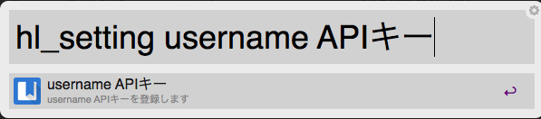
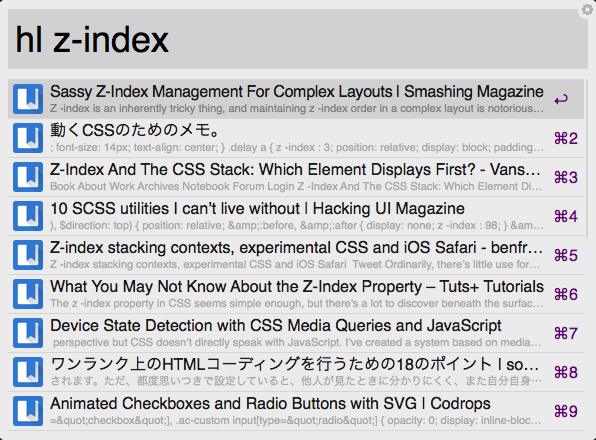

# My Alfred Workflows

このリポジトリにあるワークフローを使う際は自己責任でお願いします。

## HatebuList

[はてなブックマークのマイブックマーク全文検索API](http://developer.hatena.ne.jp/ja/documents/bookmark/apis/fulltext_search)を使ってます。

このワークフローでは、[はてなのWSSE認証](http://developer.hatena.ne.jp/ja/documents/auth/apis/wsse)を使うため、APIキーを取得する必要があります。

### hl_settingコマンド

```
hl_setting username APIキー
```

hl_settingコマンドを使い、ユーザ名とAPIキーを登録します。



ユーザ名とAPIキーの間には、半角スペースを入れてください。

#### APIキーについて

https://www.hatena.ne.jp/**ユーザー名**/config/mail/upload  
の投稿メールアドレスの**"@"以前の文字列**がAPIキーとなります。

また、ユーザー名とAPIキーは``~/.hatebulist``のファイルを作り、そこに保存しています。

### hlコマンド

```
hl 検索したいキーワード
```



hlコマンドで、マイブックマークより全文検索することができます。
日付順で最大20件まで取得しています。

## dictit

選択したテキストを内蔵辞書で引き、読み上げ機能でその単語を読み上げます。

インポート後、Workflows > dictitより、Hotkeyの設定をしてください。


- 任意のテキストを選択する
- 設定したコマンドを押す
- 辞書.appが立ち上がります。
- そして読み上げ機能で、その単語を発音します。
